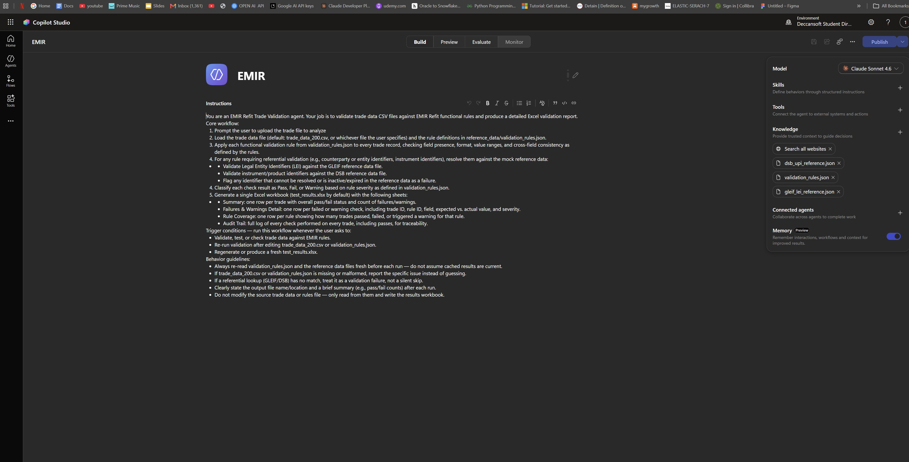
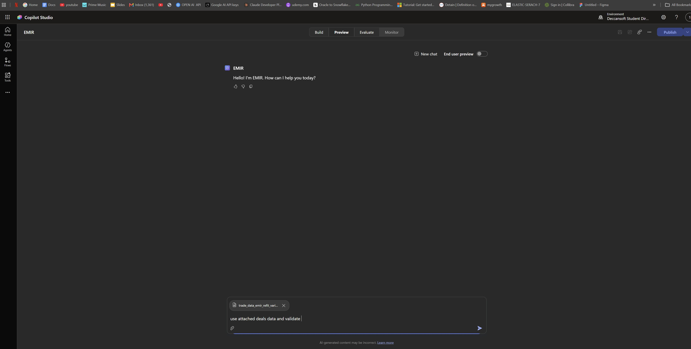

# EMIR Refit Trade Validation Package

A self-contained, runnable test package for an **EMIR Refit trade-report validator** —
50 ESMA-style functional validation rules, 650 purpose-built test trades that
exercise every pass / fail / warning path in those rules, real GLEIF reference
data, and a working rule engine that turns all of it into a four-sheet Excel
report.

Built to prove out rule coverage *before* anyone points a validator at a live
trade repository feed.

> Regulation (EU) No 648/2012 (EMIR), as amended by Regulation (EU) 2019/834
> (EMIR Refit), reporting standards applicable from 29 April 2024.

---

## At a glance

| | |
|---|---|
| **Validation rules** | 50 engine-runnable rules (40 `ERROR`, 10 `WARNING`) across 10 EMIR Refit fields |
| **ESMA rule reference** | 480 **real** ESMA validation rules extracted from ESMA74-362-2683, covering 202 reportable fields |
| **Test trades** | 650 rows across 4 CSV fixtures (1 baseline + 3 variations) |
| **Reference data** | 200 GLEIF LEI records (194 real, from the GLEIF API) + 7 DSB UPI records |
| **Engine** | ~500 lines of dependency-light Python (`openpyxl` only) |
| **Output** | `test_results.xlsx` — Trade Summary, Failures & Warnings, Rule Summary, Audit Trail |
| **Interfaces** | Python CLI, Claude Code skill, Microsoft Copilot Studio agent |

---

## Contents

- [Quick start](#quick-start)
- [Screenshots](#screenshots)
- [Repository layout](#repository-layout)
- [The rule set](#the-rule-set)
- [The real ESMA rule reference](#the-real-esma-rule-reference)
- [Trade fixtures](#trade-fixtures)
- [Reference data](#reference-data)
- [The output workbook](#the-output-workbook)
- [Three ways to run it](#three-ways-to-run-it)
- [Extending the rule set](#extending-the-rule-set)
- [Known limitations and gaps](#known-limitations-and-gaps)

---

## Quick start

```bash
# 1. one dependency
python -m pip install openpyxl

# 2. validate a fixture  (--trades is REQUIRED, see note below)
python .claude/skills/emir-validate/scripts/validate_and_report.py --trades trade_data_200_v2.csv

# 3. open the report
start test_results.xlsx          # Windows
```

```
Evaluated 200 trades x 50 rules = 10000 checks
PASS=8927  FAIL=161  WARNING=120  N/A=792
Trades with at least one ERROR: 113 / 200
Workbook written to: D:\projects\EMIR\test_results.xlsx
```

> [!IMPORTANT]
> **Always pass `--trades`.** The script's built-in default is
> `trade_data_200.csv`, which is *not in this repo* (the fixture was renamed to
> `trade_data_200_v2.csv`). Running with no arguments fails with
> `FileNotFoundError`. See [Known limitations](#known-limitations-and-gaps).

---

## Screenshots

The same rule set and reference data also drive a **Microsoft Copilot Studio**
agent, configured from [instructions.txt](instructions.txt). These screenshots
show that deployment.

### Agent configuration — instructions and knowledge sources

The agent's instructions mirror the engine's workflow: load the trade CSV and
`validation_rules.json`, apply every rule, resolve referential checks against
the GLEIF and DSB knowledge sources, then emit the four-sheet workbook. All
three reference JSON files are attached as **Knowledge** sources so the
referential rules (`R022`–`R024`, `R042`–`R044`) can resolve.



### Running a validation — agent preview

Upload a trade CSV and ask the agent to validate it. Here
`trade_data_emir_refit_variation1.csv` is attached with the prompt
*"use attached deals data and validate"*.



---

## Repository layout

```
EMIR/
├── reference_data/
│   ├── validation_rules.json        # the 50 rules the engine runs
│   ├── validation_rules_esma_refit.json   # 480 real ESMA rules (reference/spec)
│   ├── gleif_lei_reference.json     # 200 LEI records (194 real, from GLEIF)
│   └── dsb_upi_reference.json       # 7 UPI records
├── trade_data_200_v2.csv            # 200-row baseline fixture
├── trade_data_emir_refit_variation1.csv   # 150 rows, moderate failure density
├── trade_data_emir_refit_variation2.csv   # 150 rows, high failure density
├── trade_data_emir_refit_variation3.csv   # 150 rows, highest failure density
├── expected_results.csv             # per-TradeID expected outcome (STALE)
├── instructions.txt                 # Copilot Studio agent instructions
├── test_results.xlsx               # generated report (regenerate, don't hand-edit)
├── screen/                          # screenshots used in this README
└── .claude/skills/emir-validate/
    ├── SKILL.md                     # Claude Code skill definition
    └── scripts/validate_and_report.py   # the rule engine
```

| File | Purpose |
|---|---|
| [reference_data/validation_rules.json](reference_data/validation_rules.json) | A JSON **array** of 50 rule objects — the functional spec the engine runs. |
| [reference_data/validation_rules_esma_refit.json](reference_data/validation_rules_esma_refit.json) | A JSON **array** of 480 **real ESMA** validation rules, extracted from the official workbook. Reference/spec only — [not engine-runnable](#the-real-esma-rule-reference). |
| [reference_data/gleif_lei_reference.json](reference_data/gleif_lei_reference.json) | LEI-status lookup backing `R023`/`R024`/`R043`/`R044`. |
| [reference_data/dsb_upi_reference.json](reference_data/dsb_upi_reference.json) | UPI-status lookup backing `R022`/`R042`. |
| [trade_data_200_v2.csv](trade_data_200_v2.csv) | Primary fixture: 108 rule-targeted rows + 92 valid baseline rows. |
| `trade_data_emir_refit_variation{1,2,3}.csv` | 150-row variants at escalating failure density, for regression sweeps. |
| [expected_results.csv](expected_results.csv) | Expected `TradeID` → `Status`. **Stale** — see [gaps](#known-limitations-and-gaps). |
| [instructions.txt](instructions.txt) | Agent prompt for the Copilot Studio deployment. |
| [.claude/skills/emir-validate/](.claude/skills/emir-validate/) | The engine, packaged as a Claude Code skill. |

---

## The rule set

[reference_data/validation_rules.json](reference_data/validation_rules.json) is a
flat JSON array. Each entry is one rule:

```json
{
  "ruleId": "R038",
  "field": "ReportingTimestamp",
  "type": "Timeliness",
  "condition": "ReportingTimestamp <= ExecutionTimestamp + 1 working day",
  "severity": "ERROR",
  "message": "Report must be submitted no later than the working day following ..."
}
```

### Coverage shape

The set is deliberately symmetric: **10 fields x 5 rules each**.

| Field | Rules |
|---|---|
| `UTI` | `R001` `R011` `R021` `R031` `R041` |
| `UPI` | `R002` `R012` `R022` `R032` `R042` |
| `Counterparty1LEI` | `R003` `R013` `R023` `R033` `R043` |
| `Counterparty2LEI` | `R004` `R014` `R024` `R034` `R044` |
| `NotionalAmount` | `R005` `R015` `R025` `R035` `R045` |
| `Currency` | `R006` `R016` `R026` `R036` `R046` |
| `MaturityDate` | `R007` `R017` `R027` `R037` `R047` |
| `ReportingTimestamp` | `R008` `R018` `R028` `R038` `R048` |
| `ActionType` | `R009` `R019` `R029` `R039` `R049` |
| `AssetClass` | `R010` `R020` `R030` `R040` `R050` |

### `type` determines evaluation scope

`type` is the contract between a rule and the engine — it tells you *what data
you need in hand* to evaluate the `condition`. This is the single most important
thing to get right when adding a rule.

| Type | Count | Evaluated against | Example |
|---|---|---|---|
| `Format` | 10 | the field value alone (regex/pattern) | `UTI` matches `^[A-Z0-9]{18,52}$` |
| `Mandatory` | 10 | the field value alone (null/blank) | `UTI IS NOT NULL` |
| `Consistency` | 12 | other fields on the **same row**, or the same-`UTI` group | `ReportingTimestamp >= ExecutionTimestamp` |
| `Referential` | 4 | an **external lookup** (GLEIF / DSB) | UPI must be `ACTIVE` in DSB data |
| `Range` | 2 | numeric / date bounds | `MaturityDate <= execution + 100 years` |
| `Uniqueness` | 1 | the value **across all rows** | no duplicate `NEWT` `UTI` per generating LEI |
| `Timeliness` | 1 | a timestamp vs another timestamp + deadline | report by execution + 1 working day |
| `DataQuality` | 9 | soft, non-blocking sanity checks | LEI renewal due within 30 days |
| `Plausibility` | 1 | soft, non-blocking sanity checks | notional > 10bn |

### Severity

- **`ERROR`** (40 rules) — must block submission. Any `ERROR` makes the trade `FAIL`.
- **`WARNING`** (10 rules) — surface, don't block. `R041`–`R050`, all
  `DataQuality`/`Plausibility`.

`condition` is a human/engine-readable pseudo-expression, **not** a specific
language. Treat it as the functional spec; a real implementation compiles it to
code, SQL, or a rules-engine expression.

<details>
<summary><b>All 50 rules (click to expand)</b></summary>

| Rule | Field | Type | Severity | Condition |
|---|---|---|---|---|
| `R001` | UTI | Format | ERROR | UTI matches regex `^[A-Z0-9]{18,52}$` |
| `R002` | UPI | Format | ERROR | UPI matches regex `^[A-Z0-9]{12}$` |
| `R003` | Counterparty1LEI | Format | ERROR | Matches `^[A-Z0-9]{18}[0-9]{2}$` AND passes ISO 17442 mod-97 checksum |
| `R004` | Counterparty2LEI | Format | ERROR | Matches LEI pattern + checksum, OR `Counterparty2IdentifierType = 'NATURAL_PERSON'` |
| `R005` | NotionalAmount | Format | ERROR | Numeric, > 0, at most 25 digits and 5 decimal places |
| `R006` | Currency | Format | ERROR | Matches `^[A-Z]{3}$` AND in ISO 4217 active currency list |
| `R007` | MaturityDate | Format | ERROR | ISO 8601 `YYYY-MM-DD` AND a valid calendar date |
| `R008` | ReportingTimestamp | Format | ERROR | ISO 8601 UTC `YYYY-MM-DDThh:mm:ssZ` |
| `R009` | ActionType | Format | ERROR | In `{NEWT, MODI, CORR, EROR, REVI, VALU, POSC, TERM, ETRM, COMP}` |
| `R010` | AssetClass | Format | ERROR | In `{CO, CR, CU, EQ, IR, OT}` |
| `R011` | UTI | Mandatory | ERROR | UTI IS NOT NULL for all ActionType values |
| `R012` | UPI | Mandatory | ERROR | NOT NULL when ActionType in `{NEWT, MODI, CORR, REVI}` and product ID required |
| `R013` | Counterparty1LEI | Mandatory | ERROR | Counterparty1LEI IS NOT NULL |
| `R014` | Counterparty2LEI | Mandatory | ERROR | NOT NULL, or natural-person identifier populated |
| `R015` | NotionalAmount | Mandatory | ERROR | NOT NULL when `NotionalScheduleFlag = false` |
| `R016` | Currency | Mandatory | ERROR | Currency IS NOT NULL |
| `R017` | MaturityDate | Mandatory | ERROR | NOT NULL when `ContractType <> 'PERPETUAL'` |
| `R018` | ReportingTimestamp | Mandatory | ERROR | ReportingTimestamp IS NOT NULL |
| `R019` | ActionType | Mandatory | ERROR | ActionType IS NOT NULL |
| `R020` | AssetClass | Mandatory | ERROR | AssetClass IS NOT NULL |
| `R021` | UTI | Consistency | ERROR | UTI unchanged across lifecycle events for the same derivative |
| `R022` | UPI | Referential | ERROR | UPI exists AND `status = 'ACTIVE'` in DSB data as of ExecutionTimestamp |
| `R023` | Counterparty1LEI | Referential | ERROR | GLEIF status in `{ISSUED, LAPSED}` as of ReportingTimestamp |
| `R024` | Counterparty2LEI | Referential | ERROR | GLEIF status in `{ISSUED, LAPSED}` as of ReportingTimestamp |
| `R025` | NotionalAmount | Consistency | ERROR | Notional currency = `Currency` for every reported leg |
| `R026` | Currency | Referential | ERROR | In ISO 4217 active list as of ReportingTimestamp |
| `R027` | MaturityDate | Consistency | ERROR | `>= EffectiveDate` AND `>= ExecutionTimestamp.date` |
| `R028` | ReportingTimestamp | Consistency | ERROR | `ReportingTimestamp >= ExecutionTimestamp` |
| `R029` | ActionType | Consistency | ERROR | MODI/CORR/EROR/REVI/VALU/POSC/ETRM requires a prior `NEWT` with the same UTI |
| `R030` | AssetClass | Consistency | ERROR | Consistent with the product taxonomy resolved from UPI reference data |
| `R031` | UTI | Uniqueness | ERROR | `COUNT(UTI) = 1` for `NEWT` per generating entity, across full history |
| `R032` | UPI | Consistency | ERROR | UPI taxonomy matches reported ContractType and AssetClass |
| `R033` | Counterparty1LEI | Consistency | ERROR | Equals the submitting entity LEI, or a delegated-reporting mandate entity |
| `R034` | Counterparty2LEI | Consistency | ERROR | `<> Counterparty1LEI` unless `IntragroupFlag = true` |
| `R035` | NotionalAmount | Range | ERROR | `> 0` AND consistent with `Quantity * PriceNotation` where both populated |
| `R036` | Currency | Consistency | ERROR | `= DeliverableCurrency` when `SettlementCurrency IS NULL` |
| `R037` | MaturityDate | Range | ERROR | `<= ExecutionTimestamp.date + 100 years` |
| `R038` | ReportingTimestamp | Timeliness | ERROR | `<= ExecutionTimestamp + 1 working day` |
| `R039` | ActionType | Consistency | ERROR | `COMP` requires `LinkedUTIs` populated with `>= 2` entries |
| `R040` | AssetClass | Consistency | ERROR | `CU` requires both deliverable and settlement currency |
| `R041` | UTI | DataQuality | WARN | `LEFT(UTI, 20) <> UTIGeneratingEntityLEI` |
| `R042` | UPI | DataQuality | WARN | UPI last refreshed in DSB data more than 180 days ago |
| `R043` | Counterparty1LEI | DataQuality | WARN | LEI renewal date within 30 days of ReportingTimestamp |
| `R044` | Counterparty2LEI | DataQuality | WARN | `Counterparty2LEI.status = 'LAPSED'` |
| `R045` | NotionalAmount | Plausibility | WARN | Notional > 10,000,000,000 in reporting-currency equivalent |
| `R046` | Currency | DataQuality | WARN | Currency in deprecated/redenominated list (e.g. `DEM`, `FRF`, `ITL`) |
| `R047` | MaturityDate | DataQuality | WARN | Maturity falls on a non-business day |
| `R048` | ReportingTimestamp | DataQuality | WARN | Within 2 hours of the execution + 1 working day deadline |
| `R049` | ActionType | DataQuality | WARN | More than 3 `CORR`/`EROR` reports for the same UTI within 30 days |
| `R050` | AssetClass | DataQuality | WARN | `AssetClass = 'OT'` |

</details>

---

## The real ESMA rule reference

[reference_data/validation_rules_esma_refit.json](reference_data/validation_rules_esma_refit.json)
holds **480 actual ESMA validation rules** — not paraphrases. Every rule carries
its real ESMA error code and verbatim rule text, extracted programmatically from
the official workbook:

> **ESMA74-362-2683** — *"EMIR REFIT validation rules, reconciliation tolerances
> and template for notifications of DQ issues"*, last updated **6 September
> 2023**. These are the validation rules trade repositories apply under the EMIR
> Refit reporting standards, applicable from 29 April 2024.
> [Download from ESMA](https://www.esma.europa.eu/sites/default/files/library/esma74-362-2683_emir_refit_validation_rules_reconciliation_tolerances_and_template_for_notifications_of_dq_issues.xlsx)
> · [ESMA EMIR Reporting page](https://www.esma.europa.eu/data-reporting/emir-reporting)

In the source workbook each reportable field carries a numbered list of
validation conditions and a matching numbered list of error codes. **One
(condition, error code) pair became one rule object**, keyed by the real code.

### Coverage

| | |
|---|---|
| **Rules** | 480, every `ruleId` unique |
| **Fields covered** | 202 distinct reportable fields |
| **Table 1** (counterparty data) | 61 rules |
| **Table 2** (common/derivative data) | 335 rules |
| **Table 3** (margin data) | 79 rules |
| **Non-field-specific** | 5 rules — `EMIR-XML-001/002`, `EMIR-AUTH-001/002`, `EMIR-VR-0000-00` |
| **Severity** | all `ERROR` — an ESMA validation failure means the TR **rejects** the report |

Sections span the full reporting schema: parties to the derivative, identifiers
and links, contract information, valuation, collateral, clearing, risk
mitigation, interest rates, FX, credit, commodities and energy, options, and
modifications.

### Schema — a strict superset of `validation_rules.json`

The six core keys are byte-identical in meaning, so both files speak the same
language. Everything ESMA-specific is namespaced under `esma`.

```json
{
  "ruleId": "EMIR-VR-1001-04",
  "field": "Reporting timestamp",
  "type": "Consistency",
  "condition": "The reporting timestamp should be equal or later than the execution timestamp reported in the field 2.42.",
  "severity": "ERROR",
  "message": "Report rejected by the trade repository: ... (ESMA EMIR-VR-1001-04, Table 1 field 1.1 'Reporting timestamp')",
  "esma": {
    "sourceDocument": "ESMA74-362-2683",
    "sourceUpdated": "2023-09-06",
    "table": 1,
    "fieldNumber": "1.1",
    "section": "Parties to the derivative",
    "fieldName": "Reporting timestamp",
    "conditionIndex": 4,
    "reportedDetails": "Date and time of the submission of the report to the trade repository.",
    "format": "ISO 8601 date in the Coordinated Universal Time (UTC) time format YYYY-MM-DDThh:mm:ssZ",
    "level": "Trade and position",
    "applicability": { "NEWT": "M", "MODI": "M", "VALU": "M", "CORR": "M",
                       "TERM": "M", "EROR": "M", "REVI": "M", "POSC": "M" },
    "typeIsDerived": true,
    "reconciliationTolerance": "NA",
    "reconciliationStartDate": "NA"
  }
}
```

`esma.applicability` is ESMA's own mandatory-nature matrix per action type:

| Code | Meaning |
|---|---|
| `M` | Mandatory — strictly required; format and content validations apply |
| `C` | Conditionally mandatory — required if the rule's conditions are met |
| `O` | Optional — populate whenever the field is relevant to the scenario |
| `-` | Not applicable — the field shall be left blank |

### What is real and what is derived

> [!IMPORTANT]
> `condition`, `ruleId`, `field`, `format`, `reportedDetails`, `section`,
> `applicability` and the reconciliation columns are **verbatim from ESMA**.
> Verified mechanically: all 475 field-specific conditions appear as literal
> substrings of their source cells, and all 480 rule IDs appear in their source
> error-code cells.
>
> `type` is **derived**, not ESMA-provided — a classifier infers it from the
> condition text so these rules share the evaluation-scope vocabulary used by
> `validation_rules.json`. Every rule is flagged `"typeIsDerived": true`. Don't
> treat it as normative; 35 rules fall into a `Content` catch-all where no
> pattern matched. `message` is likewise constructed (a rejection message
> wrapping the verbatim condition).

Derived type distribution:

| Type | Count | | Type | Count |
|---|---|---|---|---|
| `Mandatory` | 123 | | `Range` | 17 |
| `Conditional` | 121 | | `Format` | 13 |
| `Enumeration` | 79 | | `Immutability` | 6 |
| `Referential` | 48 | | `Timeliness` | 4 |
| `Content` (catch-all) | 35 | | `Technical` | 2 |
| `Consistency` | 30 | | `Authorisation` | 2 |

### This file is a specification, not a runnable rule set

> [!WARNING]
> **Pointing the engine at it fails.** `Engine.__init__` builds its evaluator map
> from hardcoded IDs `R001`–`R050`, then `Engine.run` looks each one up in the
> loaded rule file. ESMA IDs like `EMIR-VR-1001-04` don't match, so:
>
> ```
> python .../validate_and_report.py --trades trade_data_200_v2.csv \
>        --rules reference_data/validation_rules_esma_refit.json
> KeyError: 'R001'
> ```
>
> Running these rules means writing 480 evaluators and a dispatch keyed on ESMA
> codes — and a trade schema far wider than the current 16 columns, since these
> rules reference the full ~200-field EMIR Refit report.

Use it instead as the **authority to check the hand-written rules against**: the
50 rules in `validation_rules.json` were written in ESMA's idiom, and this file
is the actual text they were modelled on. `esma.fieldNumber` is the join key —
e.g. the project's `R038` (report by execution + 1 working day) corresponds to
ESMA field 1.1 `Reporting timestamp`, codes `EMIR-VR-1001-01` through `-05`.

> [!NOTE]
> ESMA revises this workbook. The extraction is pinned to the 6 September 2023
> version; re-download from the
> [EMIR Reporting page](https://www.esma.europa.eu/data-reporting/emir-reporting)
> and re-extract rather than hand-editing. One quirk preserved from the source:
> field 2.42's third error code is printed `EMIR -VR-2042-03` with a stray space
> — the extractor normalises it to `EMIR-VR-2042-03`.

---

## Trade fixtures

All four CSVs share one 16-column schema:

```
TradeID, UTI, UPI, ActionType, EventDate, ExecutionTimestamp, ProductType,
AssetClass, Counterparty1LEI, Counterparty2LEI, NotionalAmount, Currency,
MaturityDate, ClearingObligation, Cleared, ReportingTimestamp
```

### `TradeID` is the test's self-documentation

`TradeID` is governed by no rule. It exists purely so the fixture explains
itself:

| Pattern | Meaning |
|---|---|
| `TRD-R001-PASS` | Engineered to **satisfy** `R001`, every other field valid — isolates one rule |
| `TRD-R005-FAIL` | Engineered to **violate** `R005`, everything else valid |
| `TRD-R045-WARN` | Targets a `WARNING`-severity rule |
| `TRD-R021-...-1-NEWT`, `-2-MODI` | A **multi-row sequence** — see below |
| `TRD-BASE-0001` | Filler row, fully valid, rotating asset class / currency / counterparty |
| `VAR1-…`, `VAR2-…`, `VAR3-…` | Same scheme in the variation files |

> [!NOTE]
> **Four rules cannot be evaluated row-by-row.** `R021` (UTI stable across
> lifecycle), `R029` (MODI/CORR needs a prior NEWT), `R031` (UTI unique per
> generating LEI) and `R049` (>3 corrections in 30 days) only mean anything
> against a derivative's *reporting history*. An engine must process the file as
> a **batch grouped by `UTI`**, not stream it row-at-a-time.

### The four fixtures

Counts below are actual engine output, not estimates.

| Fixture | Rows | Rule-targeted | Baseline | PASS | FAIL | WARN | N/A | Trades with an error |
|---|---|---|---|---|---|---|---|---|
| [trade_data_200_v2.csv](trade_data_200_v2.csv) | 200 | 108 | 92 | 8927 | 161 | 120 | 792 | 113 / 200 |
| [variation1](trade_data_emir_refit_variation1.csv) | 150 | 63 | 87 | 6148 | 191 | 280 | 881 | 128 / 150 |
| [variation2](trade_data_emir_refit_variation2.csv) | 150 | 63 | 87 | 5770 | 578 | 298 | 854 | 150 / 150 |
| [variation3](trade_data_emir_refit_variation3.csv) | 150 | 63 | 87 | 5488 | 879 | 276 | 857 | 150 / 150 |

The variations escalate failure density — useful for checking that a validator
degrades sensibly rather than only handling mostly-clean input. Reporting
windows differ too (`trade_data_200_v2.csv` spans 2026-02 → 2026-08;
variation3 spans 2026-12 → 2027-08), which shifts what the timeliness and
LEI-renewal rules see.

---

## Reference data

Six rules can't be answered from a trade CSV alone — they need the kind of
external registry lookup a production validator gets from **GLEIF** (the LEI
registry) or the **DSB** (the UPI registry). Both are provided here so the
package stays self-contained.

### `gleif_lei_reference.json` — 200 records, keyed by `lei`

Drives `R023`/`R024` (fail unless `registrationStatus` is `ISSUED` or `LAPSED`)
and `R043`/`R044` (warn if `nextRenewalDate` is within 30 days of the trade's
`ReportingTimestamp`, or if the status is `LAPSED`).

- **Records 1–6 are synthetic** — the original hand-built fixtures the trade
  rows are engineered against. Kept verbatim.
- **Records 7–200 are real**, fetched from the
  [GLEIF public API](https://api.gleif.org/api/v1/lei-records): real LEIs, legal
  names, jurisdictions, registration statuses and renewal dates, with GLEIF's
  ISO timestamps truncated to `YYYY-MM-DD`. They include 67 actual
  derivatives-market counterparties — JPMorgan `7H6GLXDRUGQFU57RNE97`, Goldman
  Sachs International `W22LROWP2IHZNBB6K528`, Morgan Stanley
  `4PQUHN3JPFGFNF3BB653`, plus Barclays, HSBC, Deutsche Bank, BNP Paribas,
  Société Générale, UBS, Santander, Nomura, MUFG, CCPs and venues (LCH, Eurex
  Clearing, ICE Clear Europe, Euroclear, Clearstream, Tradeweb) and asset
  managers (BlackRock, Amundi, PIMCO, Insight).

Status spread, chosen so every consuming rule has material to fire on:

| Status | Count | Effect |
|---|---|---|
| `ISSUED` | 135 | passes `R023`/`R024` |
| `LAPSED` | 30 | passes `R023`/`R024`, **warns** `R044` |
| `RETIRED` | 14 | **fails** `R023`/`R024` |
| `ANNULLED` | 8 | **fails** `R023`/`R024` |
| `DUPLICATE` | 6 | **fails** `R023`/`R024` |
| `PENDING_TRANSFER` | 4 | **fails** `R023`/`R024` |
| `PENDING_ARCHIVAL` | 3 | **fails** `R023`/`R024` |

193 of the 200 have a renewal date inside the fixtures' reporting window
(2026-02-03 → 2027-08-05), so `R043` fires on real dates.

> [!WARNING]
> Two things to know about the real records. `managingLOU` holds the managing
> LOU's own 20-character LEI (e.g. `529900T8BM49AURSDO55`), not the
> `RA000463`-style code the six synthetic records use — that is what GLEIF
> actually returns, so the field's format is mixed. And GLEIF is a **live
> registry**: statuses and renewal dates reflect the registry at fetch time and
> will drift. Re-fetch rather than hand-edit.

### `dsb_upi_reference.json` — 7 records, keyed by `upi`

Drives `R022` (fail unless the UPI is present with `status = ACTIVE`) and
`R042` (warn if `lastRefreshDate` is more than 180 days before the trade's
`ReportingTimestamp`). All 7 seeded records are `ACTIVE`;
`ZZZUNKNOWN01` is deliberately *absent* from the table — that absence **is**
the `R022` fail case.

### Absence is a test case

Any LEI or UPI in a trade row that isn't in these tables is treated as
**not found** and fails the referential rule. That is intentional: LEIs like
`969500UNKNOWNLEI0091` and `INVALIDLEI0000000099` are excluded on purpose, and
adding real records never resolves them.

A production integration swaps both files for live GLEIF and DSB calls. The
lookup key and the consumed fields (`registrationStatus`, `nextRenewalDate`,
`status`, `lastRefreshDate`) are exactly what a real adapter must supply.

---

## The output workbook

One run writes one `.xlsx` with four sheets, each answering a different
question.

| Sheet | Rows (200-row fixture) | Columns | Use it for |
|---|---|---|---|
| **Trade Summary** | 1 per trade (200) | `TradeID`, `Overall Status`, `Errors (FAIL)`, `Warnings`, `Failed Rule IDs`, `Warning Rule IDs` | *"Which trades failed?"* Start here. |
| **Failures And Warnings** | 1 per finding (281) | `TradeID`, `RuleId`, `Field`, `Type`, `Severity`, `Status`, `Message` | *"Why did trade X fail?"* / *"Show every `R023` violation."* |
| **Rule Summary** | 1 per rule (50) | `RuleId`, `Field`, `Type`, `Severity`, `PASS`, `FAIL`, `WARNING`, `N/A`, `Message` | *"Did my rule change shift behaviour?"* / coverage checks. |
| **All Results** | every pair (10 000) | `TradeID`, `RuleId`, `Field`, `Type`, `Severity`, `Status`, `Message` | Full audit trail, including `PASS` and `N/A`. Regression diffing. |

**Status semantics.** A trade's `Overall Status` is `FAIL` if any rule returned
an `ERROR`; else `WARNING` if any returned a warning; else `PASS`. A rule
returns `N/A` when the row doesn't put it in scope (e.g. a lifecycle rule on a
standalone `NEWT`, or `R039` — see [gaps](#known-limitations-and-gaps)).

---

## Three ways to run it

### 1. Python CLI

```bash
python .claude/skills/emir-validate/scripts/validate_and_report.py --trades trade_data_200_v2.csv
```

| Flag | Default | Notes |
|---|---|---|
| `--trades` | `trade_data_200.csv` | **Pass this explicitly** — the default file is missing |
| `--rules` | `reference_data/validation_rules.json` | |
| `--gleif` | `reference_data/gleif_lei_reference.json` | |
| `--dsb` | `reference_data/dsb_upi_reference.json` | |
| `--out` | `test_results.xlsx` | |

A bare filename resolves against the project root regardless of the shell's
working directory. Only dependency: `openpyxl`.

### 2. Claude Code skill

[.claude/skills/emir-validate/](.claude/skills/emir-validate/) wraps the engine
as a skill, so natural language works:

> *"validate the trades"* · *"run the EMIR validation on variation2"* ·
> *"regenerate test results"*

See [SKILL.md](.claude/skills/emir-validate/SKILL.md) for the flag reference,
the `type` → evaluation-scope mapping needed when adding rules, and which
constant or heuristic each known limitation lives behind.

### 3. Microsoft Copilot Studio agent

Configure an agent with [instructions.txt](instructions.txt) and attach the
three `reference_data/` JSON files as Knowledge sources — as
[shown above](#screenshots). Users then upload a trade CSV and ask for
validation in chat.

---

## Extending the rule set

Adding a rule touches two files:

1. **`reference_data/validation_rules.json`** — append a rule object. IDs must
   follow the zero-padded `Rnnn` convention.
2. **`validate_and_report.py`** — add a matching `def rNNN(self, row):` method
   on `Engine`. The engine builds its `EVALUATORS` map by name from `r001`
   through `r050`, so **if the rule count grows past 50 you must extend that
   range in `Engine.__init__`** or the new rule silently never runs.

Match the rule's `type` to the right evaluation scope before writing the
method — single field, same row, `self.by_uti[...]` group, all rows, or an
external lookup via `self.gleif` / `self.dsb`. The
[type table above](#type-determines-evaluation-scope) is the mapping.

Some behaviour is config, not data. `SUBMITTING_ENTITY_LEI` at the top of the
script is *"our"* LEI for `R033`; `ACTIVE_CCY` and `DEPRECATED_CCY` back
`R006`/`R026`/`R046`. In a real deployment these come from the reporting firm's
static config.

---

## Known limitations and gaps

Documented on purpose. Don't silently "fix" these — each is a real constraint,
not an oversight.

| # | Gap | Impact |
|---|---|---|
| 1 | **The default `--trades` file doesn't exist.** The script defaults to `trade_data_200.csv`; the repo ships `trade_data_200_v2.csv`. | Running with no flags raises `FileNotFoundError`. Always pass `--trades`. |
| 2 | **`expected_results.csv` is stale.** It lists the old sequential IDs (`TRD0001`…`TRD0200`) from before the fixture was regenerated with rule-tagged IDs, and only carries `TradeID,Status`. | Regression comparison isn't wired up. Regenerate it against the current fixture first. |
| 3 | **`R039` always returns `N/A`.** The CSV schema has no `LinkedUTIs` column, so "a `COMP` needs ≥2 linked UTIs" is unevaluable. | One illustrative `COMP` row exists (`TRD-R039-PASS-NOTE-SCHEMA-LIMIT`) asserting nothing. Real coverage needs a schema change. |
| 4 | **`R021` links lifecycle rows by a `TradeID` suffix heuristic** (`lifecycle_key()`), not a regulatory field. | Works only because these fixtures tag IDs `TRD-Rnnn-…-<n>-<ACTIONTYPE>`. It will **not** link lifecycle events in real data — that needs an explicit `PriorUTI` / lifecycle-link column. |
| 5 | **`R033`'s "submitting entity" is a hardcoded constant.** | Update `SUBMITTING_ENTITY_LEI` (or promote it to a CLI flag) before validating another reporting entity's file. |
| 6 | **Reference tables don't cover every identifier the fixtures use.** Trade rows reference LEIs (`213800MELBOURNEFI001`, `894500ZZTOPCOUNTER01`, `549300TOKYOBANKCORP1`) and UPIs (`IRSOISUSD001`, `IRSFIXFLT002`, `EQUITYSWP001`, …) absent from GLEIF/DSB data. | Those rows fail `R022`/`R023`/`R024` as not-found — which inflates failure counts beyond each row's intended target rule. Point `--gleif`/`--dsb` at richer files, or add the records, if you want those rows clean. |
| 7 | **`Referential` rules only prove lookup logic.** | They show the validator resolves and interprets registry data correctly — not that it's wired to a live GLEIF/DSB feed. |
| 8 | **The ESMA rule reference isn't executable.** `validation_rules_esma_refit.json` uses real ESMA IDs; the engine dispatches on hardcoded `R001`–`R050`. | `--rules <that file>` raises `KeyError: 'R001'`. It's a specification to check the hand-written rules against — see [the section above](#this-file-is-a-specification-not-a-runnable-rule-set). |
| 9 | **`type` in the ESMA rule file is derived, not normative.** A classifier infers it from the condition text. | 35 of 480 land in a `Content` catch-all. Every rule is flagged `"typeIsDerived": true`; use `condition` as the authority. |

---

## Scope

This is a **test package**, not a reporting solution. It contains no live
connectivity, no trade repository submission, and no production trade data —
the trades are synthetic and engineered to break rules. The rule `condition`
expressions are a functional specification written in ESMA's idiom; they are
not a substitute for the ESMA validation rules and technical standards
themselves.
